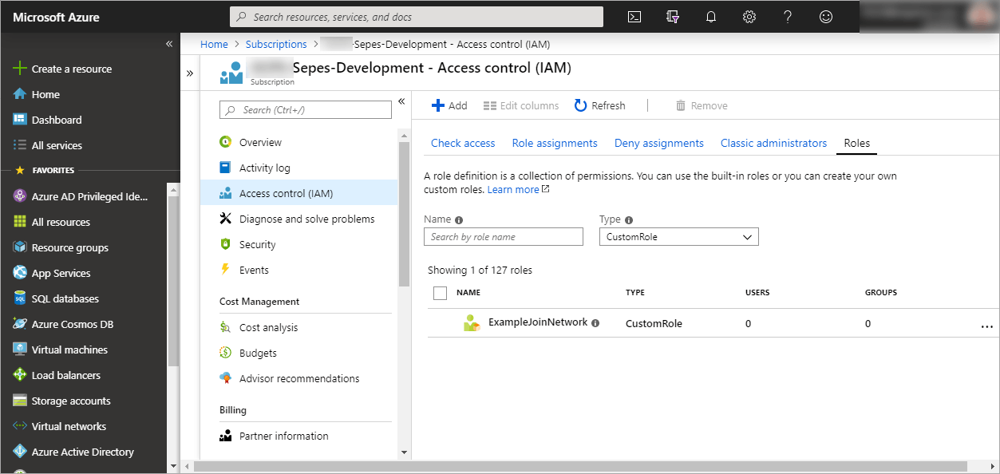

# Setup shared/common services

To write.

## 1. Add custom role for attach to network.
The first thing we need to create is a new role that allows a user to add their vm to a network that they do not control. Sadly there is no way of doing that using the portal. You have to use the azure cli.
The main azure doc on custom roles: <https://docs.microsoft.com/en-us/azure/role-based-access-control/custom-roles>

1. Install the azure cli if you have not.
   <https://docs.microsoft.com/en-us/cli/azure/install-azure-cli?view=azure-cli-latest>
2. Set it up with the correct credentials and subscription.
   * Login: https://docs.microsoft.com/en-us/cli/azure/get-started-with-azure-cli?view=azure-cli-latest
   * Manage subscription: https://docs.microsoft.com/en-us/cli/azure/manage-azure-subscriptions-azure-cli?view=azure-cli-latest
3. Create a local join_network.json file with policy rules:
```json
{
  "Name": "ExampleJoinNetwork",
  "IsCustom": true,
  "Description": "Can see and join a network",
  "Actions": [
    "Microsoft.Network/*/read",
    "Microsoft.Network/virtualNetworks/subnets/join/action"
  ],
  "NotActions": [

  ],
  "AssignableScopes": [
    "/subscriptions/{subscriptionID}"
  ]
}
```
4. Remember to substitute subscriptionID with the id of the subscription.
5. Run command `az role definition create --role-definition ./join_network.json`
6. It takes about a minute before the new role is visible in azure portal.


If the command fails that most likely mens that you do not have enough permissions.
Adding roles to a subscription require you to be owner of that subscription. Also the roles a common to an Azure ad. So its often better to augment an existing role with a new AssignableScopes than to create a new one for each subscription. If they share common azure ad.

*Note: If its only for testing and you don't have permission to add custom roles you can use the built in role Network Contributor instead of the JoinNetwork created here.*

## 2. Create Resource group.

To write.

## 3. Create gateway network.

To write.

## 4. Install gateway.

To write.